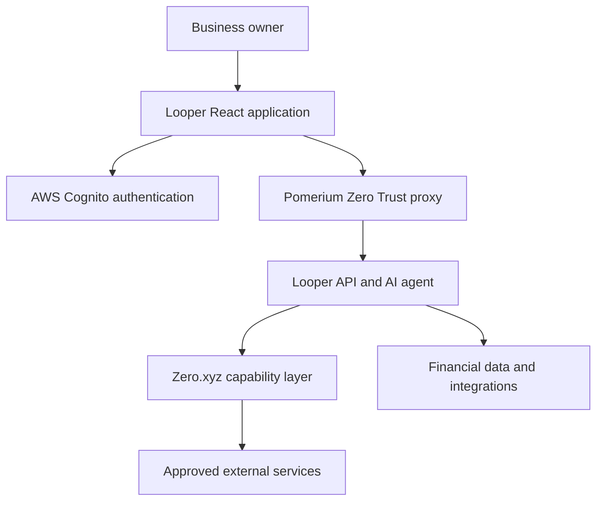

# Looper — AI CFO for Small Businesses

Looper is an AI CFO that helps small-business owners understand cash flow,
expenses, invoices, runway, payroll, and financial decisions in plain language.
The hackathon application combines a React interface with four core platform
technologies:

- **Pomerium** protects internal routes and verifies identity using Zero Trust.
- **Zero.xyz** discovers and executes approved external capabilities.
- **AWS Cognito** provides account registration and browser authentication.
- **Cursor** is the development environment used to build and test the project.

## Architecture



AWS Cognito authenticates the browser experience. Pomerium independently
protects backend routes and validates identity before traffic reaches internal
services. Zero.xyz is used only after Looper determines that an external
capability is needed.

## Local setup

Requirements:

- Node.js 22 or later
- npm
- Docker and Docker Compose for the Pomerium demo
- Cursor or another TypeScript-capable editor

Install dependencies and start the application:

```bash
npm install
cp .env.example .env
npm run dev
```

Open [http://localhost:5173](http://localhost:5173). The AWS login screen
includes **Continue with demo access**, so the hackathon interface can be used
before Cognito is configured. Demo access is stored only in `sessionStorage`
and is visibly marked as an authentication bypass.

## AWS Cognito authentication

The browser uses the official `aws-amplify` Auth library. The implementation
supports:

- Email and password sign-in
- Account registration
- Email confirmation codes
- Resending confirmation codes
- Cognito sign-in challenges
- Session restoration
- Sign-out

Create a public Cognito user-pool app client without a client secret and add its
identifiers to `.env`:

```env
VITE_AWS_COGNITO_USER_POOL_ID=us-west-2_REPLACE_ME
VITE_AWS_COGNITO_USER_POOL_CLIENT_ID=REPLACE_ME
```

Never place an AWS secret in a `VITE_` variable because Vite exposes those
values to the browser.

Important files:

- `src/lib/aws/amplify.ts` — Amplify and Cognito configuration
- `src/hooks/useAwsAuth.ts` — registration, login, confirmation, and sessions
- `src/components/auth/AwsAuthGate.tsx` — authentication and demo-access UI

## Pomerium Zero Trust

Pomerium is the security gateway for protected Looper services. The intended
production request path is:

```text
Browser → Pomerium → Looper API → AI agent → financial services
```

The backend does not trust identity headers supplied directly by the browser.
It validates Pomerium's signed JWT assertion, resolves the user to a server-side
organization membership, and applies role-based permissions.

Looper's roles are Owner, Accountant, Employee, and Viewer. Authorization is
applied to APIs, agent context, approvals, and financial tools. Pomerium and
Cognito have separate responsibilities: Cognito creates the user session;
Pomerium protects routes and internal services.

Start the supplied Pomerium Zero connector after providing a rotated enrollment
token:

```bash
export POMERIUM_ZERO_TOKEN='replace-with-secret'
docker compose up -d
```

Do not commit the enrollment token. Configuration examples are available in:

- `compose.yaml`
- `pomerium/config.example.yaml`
- `pomerium/cognito.example.yaml`
- `security/README.md`

Run the local security simulation with:

```bash
npm run demo:pomerium
```

## Zero.xyz external capabilities

Zero.xyz is Looper's external capability layer. It allows the agent to search
for a relevant service, evaluate options, request approval, execute the selected
capability, validate the result, and record the action.

Example workflows include:

- Finding a less expensive payroll provider
- Sending approved overdue-invoice reminders
- Researching competitive service pricing
- Comparing suppliers and landed costs
- Generating lender-ready financial documents

The integration includes capability ranking, per-request and daily budgets,
payload sanitization, approval tokens, financial-result validation, audit
logging, timeouts, retries, and idempotency controls. Sensitive or irreversible
actions cannot execute without approval.

Server-side configuration:

```env
ZERO_API_KEY=
ZERO_BASE_URL=
ZERO_MAX_EXECUTION_COST_USD=1
ZERO_DAILY_USER_BUDGET_USD=5
ZERO_DAILY_ORG_BUDGET_USD=25
ZERO_APPROVAL_THRESHOLD_USD=0.25
```

Never prefix the Zero API key with `VITE_` or send it to the browser. Run the
simulated capability workflow with:

```bash
npm run demo:zero
```

See `docs/zero-integration.md` for the detailed agent loop, data-minimization
rules, demo scenarios, and API contracts.

## Using Cursor as the IDE

Open the repository folder in Cursor and use its integrated terminal for the
project commands. The repository includes `.cursor/environment.json` for the
cloud development environment and `AGENTS.md` with project-specific coding
instructions.

Recommended Cursor workflow:

1. Open the repository root, not an individual source folder.
2. Run `npm install` in the integrated terminal.
3. Start the application with `npm run dev`.
4. Use Cursor's TypeScript diagnostics while editing.
5. Before completing a change, run `npm run build`, `npm run lint`, and
   `npm test`.
6. Review generated changes before committing, especially authentication,
   authorization, budgets, and approval logic.

Do not paste Cognito secrets, Pomerium enrollment tokens, Zero credentials, or
financial credentials into Cursor chat, source files, screenshots, or commits.

## Commands

| Command | Purpose |
| --- | --- |
| `npm run dev` | Start Vite at `http://localhost:5173` |
| `npm run build` | Type-check and create a production build |
| `npm run lint` | Run Oxlint |
| `npm test` | Run the Vitest suite |
| `npm run demo:pomerium` | Simulate Pomerium authentication and RBAC |
| `npm run demo:zero` | Simulate the Zero.xyz capability workflow |
| `npm run preview` | Preview the production build |

## Project structure

```text
src/
  agents/                 Looper agent and external capability tools
  app/api/zero/           Zero search, execution, and approval routes
  audit/                  External-tool audit logging
  components/             Application, agent, auth, and security UI
  hooks/                  React hooks, including AWS authentication
  lib/aws/                AWS Amplify configuration
  lib/zero/               Zero client, ranking, budgets, and validation
  security/               Approval and permission helpers
security/                 Pomerium JWT validation, RBAC, and API guards
pomerium/                 Pomerium and Cognito configuration examples
scripts/                   Hackathon simulations
```

## Security notes

- Browser-provided identity headers are never authorization evidence.
- Pomerium JWTs must be verified using trusted signing keys.
- Organization and workspace context must be resolved server-side.
- External tools receive only the minimum required data.
- Pomerium, Cognito, and Zero credentials remain server-side or in secret
  storage as appropriate.
- Demo access is UI-only and must never authorize a protected backend request.
- Financial and irreversible actions require explicit, scoped approval.
