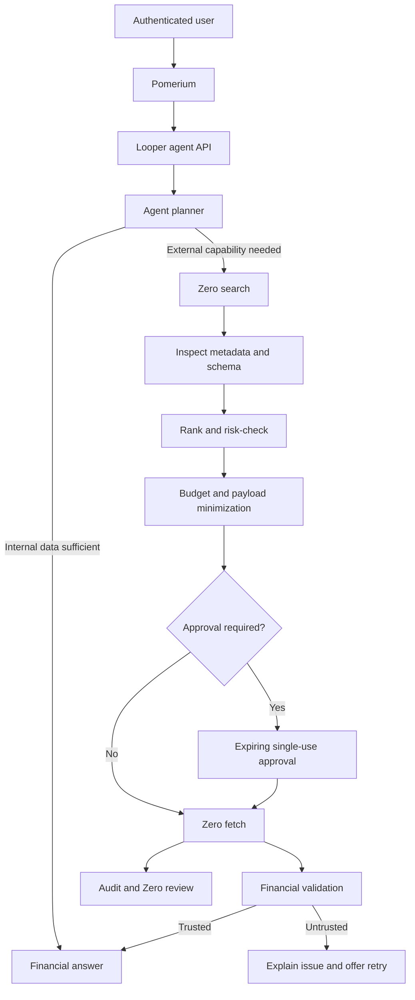

# Zero.xyz external capability layer

Looper uses the installed Zero runner as its server-side capability interface. No undocumented HTTP endpoint or API-key contract is assumed. The runner implements the required `search → get → fetch → review` lifecycle, handles x402/MPP payment, and enforces `--max-pay` per execution.

## Runtime contract

`ZeroClient` invokes the CLI with `execFile`, never a shell, so capability text cannot become executable syntax. Search results are inspected with their attribution token before ranking. Capabilities without an inspectable schema, over budget, unavailable, or irrelevant are rejected. Fetches include the search token, timeout and hard spend cap. Paid runs are reviewed.

The current Vite server exposes hackathon endpoints at `/api/zero/search`, `/api/zero/approvals`, and `/api/zero/execute`. The route modules live under `src/app/api/zero` so they can be adapted to Next.js App Router. The demo identity must be replaced with verified Pomerium context before deployment.

## Approval guarantees

Approval records expire after ten minutes, are single-use, and bind user, organization, action, capability, exact sanitized payload digest, and estimated cost. Messaging, purchases, subscriptions, invoice payments, orders, financial-data sharing, high-risk tools, and paid calls above the configured threshold require approval.

## Privacy

`sanitizeZeroPayload` removes secret-like fields, masks financial identifiers, limits array and body sizes, allows field projection, refuses uninspected schemas, and reports only shared data categories to the audit log. Pomerium assertions, cookies, service credentials, full bank identifiers, tax IDs, and unrelated records must never be sent externally.

## Demo workflows

### Payroll research

Sarah asks for a cheaper provider for 12 employees at `$620/month`. The demo presents three alternatives, recommends a `$444/month` option, calculates `$176/month` and `$2,112/year` potential savings, and stops before subscription. The production planner performs live discovery; seed data exists only for deterministic presentation.

### Invoice reminders

Looper selects invoices more than 15 days overdue, discovers a messaging capability, minimizes input to customer contact and invoice metadata, previews the message, and requires approval. Execution is idempotent and audited.

### Pricing research

Looper sends the service description and current aggregate price—not customer or bank records—to a research capability. It validates currency/ranges, explains sources and recommends a range without changing prices.

## Production migration

- Run the authenticated Zero runner beside the API worker or in a dedicated private capability service.
- Replace in-memory budgets, approvals, result cache and audit logger with transactional Postgres/Redis implementations.
- Build Zero user context only from verified Pomerium JWT plus server-side membership.
- Add distributed rate limiting, durable idempotency, approval CSRF protection and a queue for long-running calls.
- Store provider response hashes and normalized results; avoid retaining raw sensitive payloads.
- Re-search on every workflow because capability price, health and ranking change.
