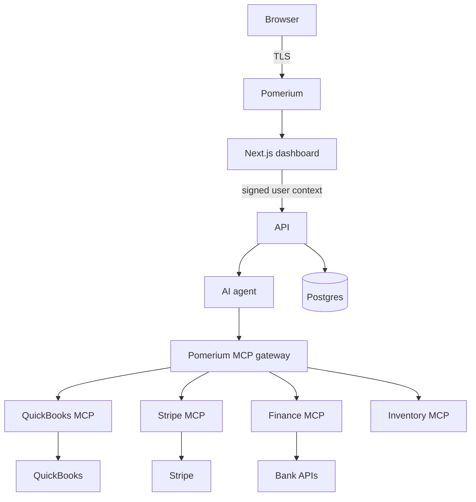
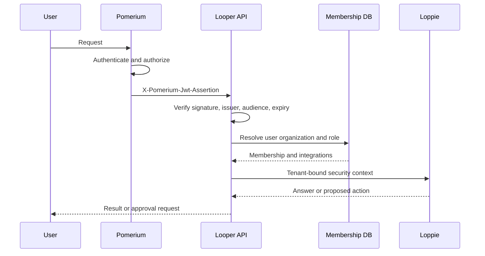

# Looper Zero Trust security

This directory is the backend security foundation for Looper. The current repository is a Vite React demo, not the Next.js/API/agent stack shown below, so the adapters are intentionally framework-independent and ready to mount in those services. The visible Settings status and approval card are demo UI; production identity and decisions must come from authenticated API responses.

## Architecture





## Security invariants

1. Backend and MCP services have no public ingress. Network policy or private subnets accept traffic only from Pomerium and known service identities.
2. APIs trust only the signed `X-Pomerium-Jwt-Assertion`; unsigned `X-Pomerium-Claim-*` and browser-supplied organization/role headers are ignored.
3. JWT verification pins issuer, audience, algorithm, signature and expiry using the route JWKS endpoint.
4. Looper resolves organization, workspace, role and integrations from its own membership database. IdP profile fields are identity hints, not tenant authorization.
5. Every query includes `organization_id` and `workspace_id`; Postgres row-level security is defense in depth.
6. Sensitive actions create immutable pending approvals. Execution uses a transaction and rechecks tenant, permission and pending status to prevent replay.
7. Audit writes are append-only and must be shipped to tamper-resistant storage with restricted read access.

## RBAC

| Role | Access |
|---|---|
| Owner | All Looper permissions, including approvals and audit reads |
| Accountant | Reports, transactions, AI, receipts and expenses |
| Employee | Receipt uploads and expense creation |
| Viewer | Read-only dashboard, report and transaction access |

Route handlers must call a permission guard even when Pomerium already allowed the route. Pomerium provides coarse identity/tool enforcement; Looper owns business authorization.

## Integration

Create the authenticator once per process:

```ts
const authenticate = createPomeriumAuthenticator({
  issuer: process.env.POMERIUM_ISSUER!,
  audience: process.env.POMERIUM_AUDIENCE!,
  jwksUrl: process.env.POMERIUM_JWKS_URL!,
  resolveMembership: lookupMembershipInPostgres,
})
```

For Next.js route handlers, wrap the handler with `createNextRouteGuard(authenticate)`. For Express, mount `expressPomeriumMiddleware(authenticate)` before routes and `expressRequire('reports:create')` on protected handlers. Both return 401 for authentication failures and 403 for missing permissions.

The edge Next.js middleware should reject requests that did not arrive through the expected Pomerium route, but cryptographic verification and RBAC still belong in the Node runtime route handler because remote JWKS behavior and database membership resolution are server concerns.

## Identity providers

Pomerium Core selects one `idp_provider`. To offer Google, Microsoft and GitHub simultaneously, configure an OIDC identity broker that exposes those three connections and set the broker as Pomerium's single OIDC provider. Alternatively, use Pomerium's hosted authentication/control-plane options. Register `https://authenticate.looper.example.com/oauth2/callback` with the provider.

## MCP

The sample routes enable Pomerium's experimental MCP support and use `mcp.server: {}`. Keep identity checks in `allow` and destructive tool restrictions in `deny`; this avoids blocking non-tool MCP methods. App-level `allowedMcpTools` further narrows tools using the authenticated user's integration grants. Never send raw QuickBooks, Stripe or bank credentials to the model.

## Deployment checklist

- Apply `security/sql/001_security.sql` and add tenant RLS policies tied to a transaction-local organization setting.
- Put dashboard, API, agent, Postgres and MCP services on private networks; expose only Pomerium.
- Load signing, cookie, shared and IdP secrets from a secret manager.
- Configure DNS/TLS for every `from` route and validate each route's audience.
- Replace `resolveDemoMembership` with a parameterized Postgres query.
- Add rate limits, request body limits, CSRF protection for cookie-authenticated mutations and idempotency keys for financial actions.
- Forward Pomerium authorize logs and Looper audit events to immutable centralized logging.
- Test direct-origin denial, expired/wrong-audience JWTs, cross-tenant IDs, every RBAC role, approval replay and MCP destructive-tool denial.

## Current limitations

Pomerium MCP support is currently documented as experimental and requires a compatible build/runtime flag. The sample config is a deployment template, not active protection on this local Vite server. Production enforcement begins only after network ingress is restricted and all public DNS points to Pomerium.
